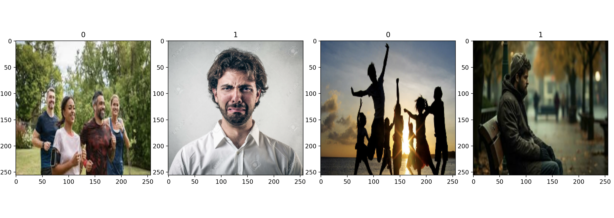
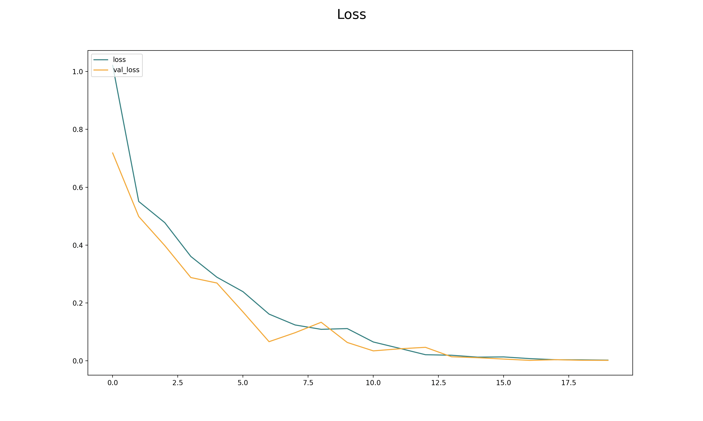

## Project : Image Classification using CNN (Convolutional Neural Networks)

<p>
  
  
</p>

### Table of contents :

1. Problem statement
2. Compatible configurations.
3. Installing packages.
4. Steps.
5. Conclusion

## 1. Problem statement :

In this project we are building an image classifier using a Convolutional Neural Network to 
categorize images into two classes : happy and sad people.
Convolutional neural networks (CNNs) are a type of artificial neural network architecture that
can perform image recognition tasks with high accuracy and efficiency.

## 2. Compatible configurations :

* Python 3
* Windows 10
* MacOS
* Linux

## 3. Installing packages :
This program uses the following Python libraries :

```
absl-py                      2.1.0
astunparse                   1.6.3
certifi                      2024.6.2
charset-normalizer           3.3.2
contourpy                    1.2.1
cycler                       0.12.1
flatbuffers                  24.3.25
fonttools                    4.53.0
gast                         0.5.4
google-pasta                 0.2.0
grpcio                       1.64.1
h5py                         3.11.0
idna                         3.7
keras                        3.3.3
kiwisolver                   1.4.5
libclang                     18.1.1
Markdown                     3.6
markdown-it-py               3.0.0
MarkupSafe                   2.1.5
matplotlib                   3.9.0
mdurl                        0.1.2
ml-dtypes                    0.3.2
namex                        0.0.8
numpy                        1.26.4
opencv-python                4.10.0.82
opt-einsum                   3.3.0
optree                       0.11.0
packaging                    24.1
pillow                       10.3.0
pip                          24.0
protobuf                     4.25.3
Pygments                     2.18.0
pyparsing                    3.1.2
python-dateutil              2.9.0.post0
python-version               0.0.2
requests                     2.32.3
rich                         13.7.1
setuptools                   63.2.0
six                          1.16.0
tensorboard                  2.16.2
tensorboard-data-server      0.7.2
tensorflow                   2.16.1
tensorflow-io-gcs-filesystem 0.37.0
termcolor                    2.4.0
typing_extensions            4.12.2
urllib3                      2.2.1
Werkzeug                     3.0.3
wheel                        0.43.0
wrapt                        1.16.0

```

## 4. Steps :

### The different steps to build an image classifier : 

  * 1 - Building a data pipeline
  * 2 - Preprocessing data
  * 3 - Building the Deep Neural Network
  * 4 - Evaluating performance
  * 5 - Saving the model

## 5. Conclusion :

  * Despite not being trained for very long or using a large amount of labeled data, the model
achieved robust performance metrics, including high accuracy (91%), precision (0.87), 
and recall (1.0).
  * The model was thoroughly evaluated, tested on new data, saved, and confirmed 
to make reliable predictions.

---